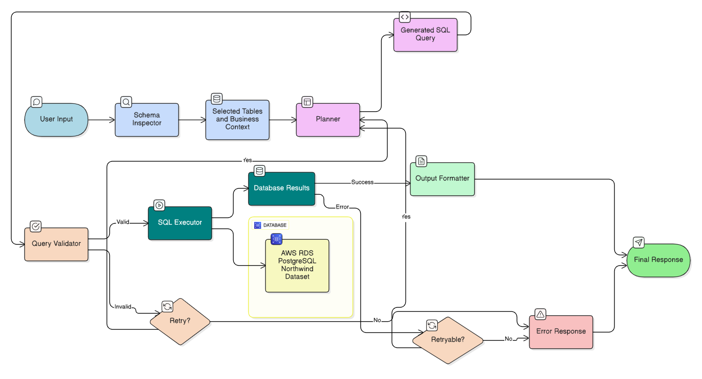

# IntelliQuery — AI-Powered Conversational Business Intelligence



**IntelliQuery** is a full-stack, AI-powered BI platform that translates natural language questions into SQL queries, executes them against a live PostgreSQL database, and automatically generates interactive visualizations — all through a conversational chat interface. Non-technical users can explore business data without writing a single line of SQL.

---

## Table of Contents

1. [Features](#features)
2. [Architecture Overview](#architecture-overview)
3. [Agent Flow (LangGraph)](#agent-flow-langgraph)
4. [Tech Stack](#tech-stack)
5. [External Services & Integrations](#external-services--integrations)
6. [Project Structure](#project-structure)
7. [API Reference](#api-reference)
8. [Dashboard & Visualizations](#dashboard--visualizations)
9. [RAG Knowledge Base](#rag-knowledge-base)
10. [Authentication & Security](#authentication--security)
11. [Database Schema](#database-schema)
12. [Environment Variables](#environment-variables)
13. [Getting Started](#getting-started)

---

## Features

### Natural Language to SQL
- Converts free-form English questions into optimized SQL queries
- Schema-aware planning — automatically identifies relevant tables and joins
- Few-shot learning via semantic similarity (ChromaDB + FastEmbed) using 23 curated Northwind examples
- Multi-turn conversation support with follow-up context tracking (last 5 query contexts)
- Query preprocessing: abbreviation expansion (`qty` → `quantity`), typo correction (Levenshtein distance), normalization

### Intelligent Query Validation
- **Syntax checking**: parentheses matching, quote balancing
- **Security scanning**: blocks dangerous keywords (`DROP`, `DELETE`, `ALTER`, `TRUNCATE`)
- **SQL injection prevention**: regex-based pattern detection, read-only enforcement
- **Business logic validation**: revenue calculation rules, date filter validation
- **Complexity estimation**: classifies queries as low / medium / high cost
- **EXPLAIN plan verification**: pre-execution validation via PostgreSQL `EXPLAIN`
- **Auto-retry**: up to 3 automatic retries on retryable errors (syntax, execution)

### Interactive Dashboard
- Drag-and-drop grid layout (React Grid Layout) with resizable panels
- 12 chart types: Bar, Line, Area, Pie, Donut, Scatter, Treemap, Radar, Funnel, Tornado, Data Table, KPI Card
- **Cross-filtering**: selecting data in one chart automatically filters all others
- In-place chart editing: change title, chart type, color scheme
- Manual Chart Builder: write custom SQL and configure chart visually
- Export charts and dashboards as PNG/PDF
- Auto-generated starter dashboard with key business metrics on first login

### RAG Knowledge Base
- Upload company documents (PDF, DOCX, TXT, MD, CSV)
- Semantic search over documents via ChromaDB + FastEmbed embeddings
- Automatic web fallback via DuckDuckGo Search when document confidence < 0.30
- Source citations with document name and page reference in every response

### Session Persistence
- Full conversation history (up to 10 turns per session)
- Dashboard state (charts, positions, filters) persisted to Redis
- 7-day session TTL; restored on re-login
- Multiple conversations per user with custom titles

### Error Handling & Observability
- Per-session error tracking with 1-hour retention
- User-friendly error messages with recovery suggestions
- Error classification: syntax / permission / connection / logic / timeout
- Graceful Redis fallback to in-memory storage if Redis is unavailable

---

## Architecture Overview

```
┌─────────────────────────────────────────────────────────┐
│                     React Frontend                       │
│  Chat UI · Dashboard · Chart Builder · RAG Upload       │
└───────────────────────┬─────────────────────────────────┘
                        │ HTTP / REST (Axios)
                        ▼
┌─────────────────────────────────────────────────────────┐
│                   FastAPI Backend                        │
│  Auth (JWT) · Session Mgmt · Query Router               │
│                        │                                │
│          ┌─────────────┴──────────────┐                 │
│          ▼                            ▼                 │
│   LangGraph SQL Agent           RAG Agent               │
│   ┌──────────────────┐    ┌──────────────────┐          │
│   │ Schema Inspector │    │  ChromaDB Store  │          │
│   │ SQL Planner      │    │  FastEmbed       │          │
│   │ Query Validator  │    │  DuckDuckGo Web  │          │
│   │ SQL Executor     │    └──────────────────┘          │
│   │ Chart Recommender│                                  │
│   └────────┬─────────┘                                  │
│            │ MCP (stdio)                                │
│   ┌────────▼─────────┐                                  │
│   │   MCP Server     │                                  │
│   │ (FastMCP tools)  │                                  │
│   └──────────────────┘                                  │
└───────────┬──────────────────────────┬──────────────────┘
            ▼                          ▼
     ┌─────────────┐          ┌───────────────┐
     │  PostgreSQL │          │     Redis     │
     │  (Northwind)│          │ (Sessions &   │
     └─────────────┘          │  Dashboard)   │
                              └───────────────┘
```

### Key Architectural Decisions

| Decision | Rationale |
|----------|-----------|
| **LangGraph StateGraph** | Deterministic multi-step workflows with typed state and conditional routing |
| **MCP Server (stdio)** | SQL execution delegated to a subprocess-based MCP server for Windows compatibility |
| **Dual embedding pipelines** | FastEmbed (local, CPU) for few-shot selection; ChromaDB for RAG document search |
| **Graceful Redis fallback** | In-memory dict fallback ensures the app runs without Redis |
| **Session-scoped error tracking** | Errors isolated per user for privacy |
| **Read-only SQL enforcement** | All database access restricted to `SELECT` statements |
| **Semantic table selection** | Only relevant tables injected into the LLM prompt — reduces token cost |

---

## Agent Flow (LangGraph)

```
User Question
      │
      ▼
[Query Preprocessor]
  · Normalize, expand abbreviations, correct typos
      │
      ▼
[Query Classifier]
  · Is this a SQL question, a follow-up, or a knowledge base query?
  ├──→ Non-SQL / Greeting  ──→ [Response Generator] ──→ Response
  ├──→ RAG Query  ──────→ [RAG Agent] ──────────────→ Response + Citations
  └──→ SQL Query ──┐
                   ▼
         [Schema Inspector Node]
           · Dynamic schema discovery
           · Semantic table selection
           · Relationship & FK detection
           · Business context injection
                   │
                   ▼
           [Planner Node]  ←──────────────┐ (retry, max 3)
             · Semantic few-shot retrieval │
             · SQL generation via Groq LLM │
             · Regex output cleaning       │
                   │                       │
                   ▼                       │
         [Query Validator Node]            │
           · Syntax validation             │
           · Security scan                 │
           · Business logic checks         │
           · EXPLAIN pre-validation        │
                   │                       │
          Valid? ──┤                       │
           │  No (retryable) ──────────────┘
           │  No (security) ──→ Error Response
           │  Yes ↓
         [SQL Executor Node]
           · Execute on PostgreSQL
           · Format results (Decimal→float, date→ISO)
                   │
                   ▼
         [Chart Recommender]
           · Keyword + data structure analysis
           · Select chart type from 12 options
           · Build chart config JSON
                   │
                   ▼
         [Output Formatter]
           · Format response message
           · Save to conversation history
           · Persist to Redis
                   │
                   ▼
              Response
         { sql, results, chart, explanation, execution_time }
```

### LangGraph Nodes

| Node | File | Responsibility |
|------|------|---------------|
| Schema Inspector | [nodes/schema_inspector.py](nodes/schema_inspector.py) | Table selection, context injection |
| Planner | [nodes/planner.py](nodes/planner.py) | SQL generation via LLM |
| Query Validator | [tools/validation_tools.py](tools/validation_tools.py) | Syntax, security, business logic |
| SQL Executor | [tools/sql_tools.py](tools/sql_tools.py) | PostgreSQL execution |
| Chart Recommender | [tools/chart_recommender.py](tools/chart_recommender.py) | Chart type selection |
| Dashboard Manager | [tools/dashboard_manager.py](tools/dashboard_manager.py) | Dashboard CRUD + persistence |
| Error Analyzer | [nodes/error_analyzer.py](nodes/error_analyzer.py) | Error classification + retry routing |

---

## Tech Stack

### Backend

| Layer | Technology | Version |
|-------|-----------|---------|
| Web Framework | FastAPI | 0.95+ |
| ASGI Server | Uvicorn | latest |
| Type Validation | Pydantic | 2.x |
| Authentication | PyJWT | latest |
| Database Driver | psycopg2-binary | latest |
| LLM Orchestration | LangChain Core | latest |
| LLM Integrations | LangChain-Groq, LangChain-Google-GenAI | latest |
| Agent/Graph Engine | LangGraph | latest |
| Vector Store | LangChain-Chroma / ChromaDB | latest |
| Local Embeddings | FastEmbed | latest |
| Document Processing | pypdf, docx2txt | latest |
| Text Splitting | langchain_text_splitters | latest |
| Web Search | duckduckgo-search | latest |
| Caching | Redis (redis-py) + in-memory fallback | latest |
| MCP Protocol | FastMCP | latest |
| Config | python-dotenv | latest |

### Frontend

| Layer | Technology | Version |
|-------|-----------|---------|
| Framework | React | 19.2.0 |
| Build Tool | Vite | 7.2.4 |
| Styling | Tailwind CSS | 4.1.18 |
| HTTP Client | Axios | 1.13.5 |
| Charting | Recharts | 3.7.0 |
| Grid Layout | react-grid-layout | 2.2.2 |
| Resize | react-resizable | 3.1.3 |
| Animations | Framer Motion | 12.34.3 |
| Export | html-to-image, html2canvas | 1.11.13 / 1.4.1 |
| Icons | Lucide React | 0.563.0 |
| Date Utilities | date-fns | 4.1.0 |
| Linting | ESLint | 9.39.1 |

---

## External Services & Integrations

### Groq (LLM Provider)
- **Model**: `llama-3.3-70b-versatile`
- **Use**: SQL generation, query planning, response synthesis
- **Config**: `GROQ_API_KEY` in `.env`
- **Temperature**: 0 (deterministic output)

### FastEmbed (Local Embeddings)
- **Model**: `sentence-transformers/all-MiniLM-L6-v2`
- **Use**: Few-shot example selection (semantic similarity matching)
- **Cost**: Runs fully locally — no API calls or fees

### ChromaDB (Vector Database)
- **Persistence path**: `rag_store/chroma_db/`
- **Collection**: `company_policies`
- **Use**: Semantic search over uploaded company documents

### DuckDuckGo Search
- **Use**: Web fallback in the RAG pipeline when document confidence < 0.30
- **Max results**: 4 per query
- **Cost**: Free, no API key required

### PostgreSQL
- **Default database**: Northwind sample dataset
- **Driver**: psycopg2-binary
- **Access pattern**: One connection per query (opened and closed)
- **Enforcement**: Read-only SELECT statements only

### Redis
- **Use**: Session persistence, dashboard state, conversation history
- **TTL**: 7 days (sessions), 1 day (queries), 1 hour (error logs)
- **Fallback**: In-memory dict if Redis is unavailable

### Model Context Protocol (MCP)
- **Server**: `server/mcp_server.py` (FastMCP, stdio transport)
- **Tools exposed**: `execute_sql_query`, schema discovery functions
- **Client**: `client/mcp_client.py`

---

## Project Structure

```
powerbi-sql-agent/
│
├── api/
│   └── main.py                    # FastAPI app — all routes (996 lines)
│
├── frontend/
│   └── src/
│       ├── App.jsx                # Main app (login, chat, session)
│       ├── contexts/
│       │   └── ThemeContext.jsx   # Dark / light theme provider
│       └── components/
│           ├── Dashboard/
│           │   ├── DashboardContainer.jsx   # Grid dashboard, drag-drop, export
│           │   ├── ChartCard.jsx            # Individual chart wrapper
│           │   ├── FilterPanel.jsx          # Cross-filter controls
│           │   ├── ManualChartBuilder.jsx   # SQL editor + chart config UI
│           │   └── ChartTypes/
│           │       ├── BarChartComponent.jsx
│           │       ├── LineChartComponent.jsx
│           │       ├── AreaChartComponent.jsx
│           │       ├── PieChartComponent.jsx
│           │       ├── DonutChartComponent.jsx
│           │       ├── ScatterChartComponent.jsx
│           │       ├── TreemapComponent.jsx
│           │       ├── RadarChartComponent.jsx
│           │       ├── FunnelChartComponent.jsx
│           │       ├── TornadoChartComponent.jsx
│           │       ├── DataTable.jsx
│           │       └── KPICard.jsx
│           ├── DataSourcesPage.jsx         # RAG document upload & management
│           ├── ReportsPage.jsx             # Report templates & export
│           ├── SecurityPage.jsx            # User roles & permissions
│           └── VisualizationHistory.jsx    # Past queries & saved results
│
├── flow/
│   ├── graph.py                   # LangGraph StateGraph definition
│   └── edge.py                    # Conditional edge routing logic
│
├── nodes/
│   ├── schema_inspector.py        # Table selection + context injection
│   ├── planner.py                 # LLM-based SQL generation
│   └── error_analyzer.py          # Error classification
│
├── state/
│   ├── agent_state.py             # AgentState Pydantic model
│   └── plan_state.py              # ExecutionPlan tracking
│
├── tools/
│   ├── schema_tools.py            # Schema inspection utilities
│   ├── sql_tools.py               # SQL execution + result formatting
│   ├── validation_tools.py        # Syntax, security, business logic validation
│   ├── chart_recommender.py       # Chart type recommendation
│   ├── dashboard_manager.py       # Dashboard CRUD + Redis persistence
│   └── error_manager.py           # Error classification + recovery
│
├── database/
│   ├── connection.py              # PostgreSQL connection
│   ├── explore_schema.py          # Schema exploration
│   ├── northwind_context.py       # Business descriptions for each table
│   ├── relationships.py           # Table relationships and join patterns
│   ├── sample_queries.py          # 23 curated few-shot examples
│   ├── schema_discovery.py        # Dynamic schema introspection
│   ├── redis_client.py            # Redis singleton
│   ├── session_store.py           # User session persistence
│   └── schema.txt                 # Pre-discovered schema snapshot
│
├── rag/
│   ├── document_store.py          # ChromaDB + document loading + chunking
│   └── rag_agent.py               # RAG query orchestration + web fallback
│
├── utils/
│   ├── query_preprocessor.py      # Abbreviation expansion, typo correction
│   └── query_classifier.py        # SQL vs non-SQL classification
│
├── config/
│   ├── error_config.py            # Error types, severity, recovery strategies
│   └── northwind_query_rules_fallback.txt
│
├── server/
│   └── mcp_server.py              # FastMCP server (stdio)
│
├── client/
│   └── mcp_client.py              # MCP client connector
│
├── testing/
│   ├── test_phase1-4.py
│   ├── run_northwind_evaluation.py
│   ├── run_spider_evaluation.py
│   └── evaluation_results.json
│
├── evaluation/
│   ├── baseline_comparison.py
│   ├── error_analysis.py
│   └── spider_evaluator.py
│
├── rag_files/                     # Uploaded document staging directory
├── rag_store/chroma_db/           # ChromaDB persistent vector store
├── run/
│   └── chat_terminal.py           # CLI chat interface for local testing
│
├── NLP_to_SQL_Agent_Flow.png      # Agent flow diagram
├── Northwind ER.png               # Entity-relationship diagram
├── northwind.sql                  # Sample database dump
├── requirements.txt               # Python dependencies
├── .env                           # Environment variables (not committed)
└── README.md
```

---

## API Reference

### Authentication

| Method | Endpoint | Description |
|--------|----------|-------------|
| `POST` | `/api/login` | Login and receive JWT token |
| `POST` | `/api/register` | Register a new user |
| `GET` | `/api/users/me` | Fetch current authenticated user |

### Query Processing

| Method | Endpoint | Description |
|--------|----------|-------------|
| `POST` | `/api/query` | Main query endpoint — NL → SQL → results + chart |

**Request body:**
```json
{ "question": "string", "session_id": "string", "conv_id": "string" }
```

**Response:**
```json
{
  "success": true,
  "sql": "SELECT ...",
  "results": [...],
  "explanation": "string",
  "chart": { "type": "bar", "config": {...} },
  "execution_time": 0.42
}
```

### Session Management

| Method | Endpoint | Description |
|--------|----------|-------------|
| `GET` | `/api/session/load` | Load user session (conversations + charts) |
| `POST` | `/api/session/save` | Save session state to Redis |
| `GET` | `/api/session/stats` | Session statistics |

### Dashboard Management

| Method | Endpoint | Description |
|--------|----------|-------------|
| `GET` | `/api/dashboard/initial` | Generate the starter dashboard |
| `GET` | `/api/dashboard/current` | Get current dashboard state |
| `POST` | `/api/dashboard/add-chart` | Add a chart from query results |
| `POST` | `/api/dashboard/cross-filter` | Apply cross-filter across charts |
| `POST` | `/api/dashboard/clear-filters` | Clear all active filters |
| `POST` | `/api/dashboard/remove-chart` | Remove a chart |
| `POST` | `/api/dashboard/update-position` | Update chart grid position |
| `DELETE` | `/api/dashboard/clear` | Clear entire dashboard |

### Manual Chart Builder

| Method | Endpoint | Description |
|--------|----------|-------------|
| `GET` | `/api/schema` | Get all tables and columns |
| `POST` | `/api/execute-query` | Execute a custom SELECT query |
| `POST` | `/api/dashboard/add-manual-chart` | Add a manually-configured chart |
| `POST` | `/api/dashboard/update-chart` | Update chart title, type, or colors |

### RAG Knowledge Base

| Method | Endpoint | Description |
|--------|----------|-------------|
| `POST` | `/api/rag/upload` | Upload a document to the knowledge base |
| `POST` | `/api/rag/query` | Query documents (with web fallback) |
| `GET` | `/api/rag/sources` | List all indexed documents |
| `DELETE` | `/api/rag/sources/{name}` | Remove a document |

### Utilities

| Method | Endpoint | Description |
|--------|----------|-------------|
| `GET` | `/` | Root health check |
| `GET` | `/health` | Detailed health status |

---

## Dashboard & Visualizations

### Chart Types

| Chart | Best For |
|-------|---------|
| **Bar Chart** | Comparisons across categories |
| **Line Chart** | Trends over time |
| **Area Chart** | Cumulative or stacked trends |
| **Pie Chart** | Proportional breakdown |
| **Donut Chart** | Distribution with center emphasis |
| **Scatter Chart** | Correlation and relationship analysis |
| **Treemap** | Hierarchical data (size-encoded) |
| **Radar Chart** | Multi-dimension performance comparison |
| **Funnel Chart** | Stage-based flow analysis |
| **Tornado Chart** | Sensitivity / impact analysis |
| **Data Table** | Tabular display for detailed data |
| **KPI Card** | Single key metric with label |

### Chart Recommendation Logic

The system analyzes query keywords and result data structure to automatically select the most appropriate chart type:

- Time-based columns → Line / Area chart
- Single numeric result → KPI Card
- Two columns (category + value) → Bar or Pie chart
- Hierarchical data → Treemap
- Correlation data → Scatter chart
- Stage/funnel keywords → Funnel chart

### Cross-Filtering

Clicking a data point in any chart automatically filters all other charts in the dashboard to the same dimension value. Filters are cleared via the filter panel or the "Clear Filters" button.

### Manual Chart Builder

Access via the "+" button on the dashboard:
1. Browse the schema panel to explore tables and columns
2. Write a custom SQL `SELECT` query in the editor
3. Execute to preview results
4. Configure chart type, colors, and title
5. Add to the dashboard

---

## RAG Knowledge Base

The RAG system allows users to ask questions about company-specific documents alongside database queries.

### Supported File Types
PDF, DOCX, TXT, MD, CSV

### Pipeline
1. **Upload**: File is saved to `rag_files/` staging directory
2. **Chunking**: Recursive character splitting (800-char chunks, 120-char overlap)
3. **Embedding**: FastEmbed encodes chunks to dense vectors
4. **Storage**: Vectors persisted in ChromaDB (`rag_store/chroma_db/`)
5. **Query**: Semantic search retrieves top-k relevant chunks
6. **Confidence check**: If max similarity < 0.30, supplement with DuckDuckGo web results
7. **Response**: Generated answer with source citations (document name + page)

---

## Authentication & Security

### JWT Authentication
- `POST /api/login` returns a signed JWT (HS256, 30-minute expiry)
- All API endpoints require `Authorization: Bearer <token>`
- Token verified via `Depends(get_current_user)` middleware on every protected route

### SQL Safety
- All queries validated before execution
- Dangerous keywords blocked: `DROP`, `DELETE`, `TRUNCATE`, `ALTER`, `INSERT`, `UPDATE`
- Regex-based SQL injection pattern detection
- Strict `SELECT`-only enforcement — no write operations permitted

### CORS
- Configured for `localhost:3000`, `3001`, `3002` (development)

### Session Isolation
- Redis keys namespaced by `session_id`
- Error logs scoped per user session
- Raw result rows stripped before persistence (re-fetched fresh on login)

---

## Database Schema

The default database is the **Northwind** sample dataset — a classic e-commerce dataset with 14 tables.

| Table | Rows | Description |
|-------|------|-------------|
| `customers` | 91 | Customer companies, contacts, locations |
| `orders` | 830 | Sales transactions, dates, shipping |
| `order_details` | 2,155 | Line items — product, qty, price, discount |
| `products` | 77 | Product catalog, pricing, inventory |
| `categories` | 8 | Product categories (Beverages, Condiments, etc.) |
| `suppliers` | 29 | Supplier companies and contacts |
| `employees` | 9 | Employee roster, titles, reporting structure |
| `employee_territories` | 49 | Employee → territory assignments |
| `shippers` | 6 | Shipping companies |
| `territories` | 53 | Geographic territory definitions |
| `region` | 4 | Eastern / Western / Northern / Southern |
| `us_states` | 51 | US state reference data |

**Core relationship chain:**
```
customers → orders → order_details → products → categories
                  ↘ employees → employee_territories → territories → region
                  ↘ shippers
                  → suppliers (via products)
```

See [Northwind ER.png](Northwind%20ER.png) for the full entity-relationship diagram.

---

## Environment Variables

Create a `.env` file in the project root:

```env
# PostgreSQL
DB_HOST=localhost
DB_PORT=5432
DB_NAME=northwind
DB_USER=postgres
DB_PASSWORD=your_password

# LLM
GROQ_API_KEY=your_groq_api_key

# Feature Flags
ENABLE_MEMORY=true
ENABLE_FEW_SHOT=true

# Logging
LOG_LEVEL=INFO

# Redis (optional — app falls back to in-memory if unavailable)
REDIS_HOST=localhost
REDIS_PORT=6379
REDIS_PASSWORD=
REDIS_DB=0
REDIS_TTL_HOURS=24

# JWT
JWT_SECRET_KEY=change-this-to-a-long-random-string
```

---

## Getting Started

### Prerequisites
- Python 3.10+
- Node.js 18+
- PostgreSQL (with Northwind database loaded)
- Redis (optional)

### Backend Setup

```bash
# Create and activate virtual environment
python -m venv venv
source venv/bin/activate        # Windows: venv\Scripts\activate

# Install dependencies
pip install -r requirements.txt

# Configure environment
cp .env.example .env
# Edit .env with your credentials

# Load Northwind database
psql -U postgres -d northwind -f northwind.sql

# Start the FastAPI server
uvicorn api.main:app --reload --port 8000
```

### Frontend Setup

```bash
cd frontend
npm install
npm run dev        # Starts on http://localhost:3000
```

### CLI Interface (optional)

```bash
python run/chat_terminal.py
```

The backend API is available at `http://localhost:8000`.
API documentation (Swagger UI) is at `http://localhost:8000/docs`.

---

## Evaluation

The `testing/` and `evaluation/` directories contain:
- **Phase 1–4 integration tests**: `testing/test_phase1-4.py`
- **Northwind evaluation suite**: `testing/run_northwind_evaluation.py`
- **Spider benchmark evaluation**: `testing/run_spider_evaluation.py` / `evaluation/spider_evaluator.py`
- **Baseline comparison**: `evaluation/baseline_comparison.py`
- **Error analysis**: `evaluation/error_analysis.py`
- **Results**: `testing/evaluation_results.json`
